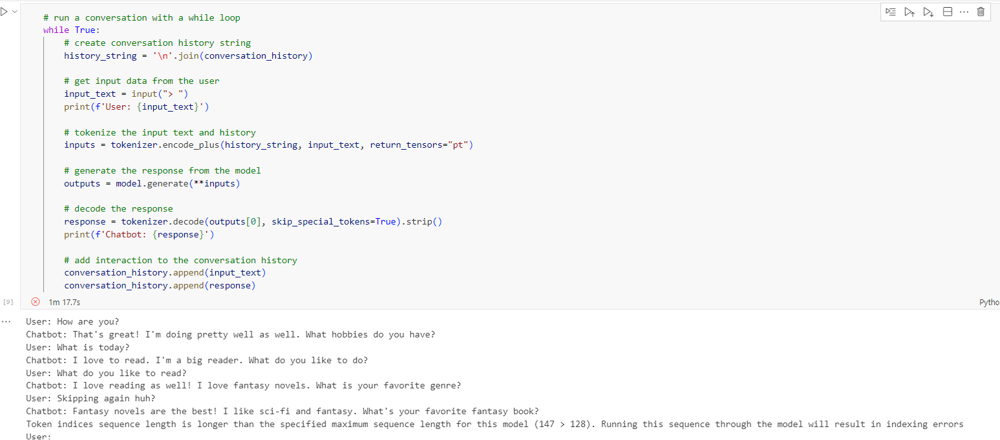

# Blenderbot-Chatbot
A simple chatbot made utilizing the Facebook Blenderbot model. The chatbot will respond to user queries, and a conversational history is recorded until the user exits the conversation loop.

## Features
- Uses the transformers library to acquire access to the Blenderbot model
- Can manage general conversations

## Requirements
- Requires Python3.12
- Requires libraries listed on requirements.txt
- Requires pip to install

## Usage
- Run all the code cells in the .ipynb file; the final code cell will generate a query bar where the user can generate queries.

## Considerations
- The chatbot cannot handle complex queries or queries that do not align with the questions it responds with.
- The response time may be delayed, and a response may only be generated once the user generates another query.
